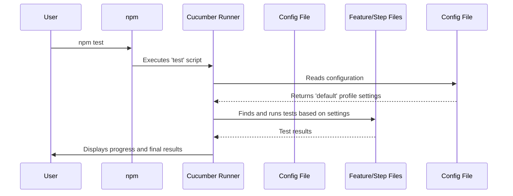

# Chapter 1: Test Execution Configuration (Cucumber)

Welcome to the `Playwright_demo` project! This tutorial will guide you through the essential concepts that make this test automation framework powerful and easy to maintain. Let's start with the very first thing you'll encounter: how to run the tests.

Imagine you're a movie director. You have the script (the tests), the actors (the code), and the set (the application). But how do you tell everyone what to do, which scenes to shoot, how many cameras to use, and where to send the final film? You need a director's script or a production plan.

In our project, that director's script is the **`cucumber.js`** file. It's the central control panel that tells our test runner, Cucumber, exactly how to execute all our tests.

### What Problem Does This Solve?

Without a central configuration file, you would have to type out long, complicated commands in your terminal every time you wanted to run your tests.

*   Want to run only the "login" tests? You'd need a special command.
*   Want to run tests on a different browser? Another command.
*   Want to generate an HTML report? Yet another command.

This gets messy and is hard for a team to manage. The `cucumber.js` file solves this by letting us define reusable "profiles" for running our tests in different ways.

### Breaking Down the `cucumber.js` File

Let's look at our project's configuration file. It might seem intimidating at first, but it's just a set of instructions. Think of it as a recipe book where each recipe is a "profile."

**File:** `config/cucumber.js`
```javascript
// We'll talk about this line in a later chapter!
//When multiple environment files are present (such as env.QA1, env.QA2, env.staging, and env.dev), the QA file specified by the user will be applied/configured in this step
require('dotenv').config({path: `src/helpers/env/.env.QA`});

module.exports = {
    default: {
        // ... settings for a normal test run ...
    },
    rerun: {
        // ... settings for re-running only failed tests ...
    }
}
```
This file exports a set of profiles. We have two here: `default` and `rerun`. Let's explore the `default` profile, which is what runs when you just type `npm test`.

#### Key Configuration Options

Here are the most important settings inside the `default` profile:

1.  **`paths`**: Where are the test scripts?
    This tells Cucumber where to find your feature files, which are the plain-English descriptions of your tests.

    ```javascript
    paths: [
        "src/tests/features/"
    ],
    ```
    This line is like a treasure map, pointing Cucumber to the `features` folder where all our test scenarios are written.

2.  **`require`**: Where is the code that performs the test steps?
    Feature files describe *what* to do (e.g., "Given I am on the login page"). The `require` option tells Cucumber where to find the code that explains *how* to do it.

    ```javascript
    require: [
        "src/tests/steps/*.ts",
        "src/hooks/hooks.ts"
    ],
    ```
    This points to our step definition files and a special file for `hooks`, which we'll cover in [Chapter 3: Test Lifecycle & Context (Hooks and Fixture)](03_test_lifecycle___context__hooks_and_fixture__.md).

3.  **`parallel`**: How many tests can run at the same time?
    To speed things up, we can run tests in parallel, like having multiple cashiers open at a supermarket.

    ```javascript
    parallel: 2,
    ```
    This setting tells Cucumber to run a maximum of two tests simultaneously.

4.  **`format`**: How should the results be displayed?
    This controls the output you see in the terminal and what kind of reports are generated.

    ```javascript
    format: [
        "progress-bar",
        "rerun:@rerun.txt"
    ],
    ```
    *   `progress-bar`: Shows a simple loading bar as the tests run.
    *   `rerun:@rerun.txt`: This is a clever one! If any test fails, Cucumber will write a reference to that failed test in a file named `@rerun.txt`. We can use this file later to *only* run the tests that failed.

### How It All Works: The "Rerun" Profile

Now, let's see how this all connects. Imagine one of your tests failed because of a temporary network issue. You don't want to run all 100 tests again; you just want to rerun that one failed test.

This is where our `rerun` profile and special `npm` scripts come in handy.

**File:** `package.json`
```json
"scripts": {
  "test": "cross-env FORCE_COLOR=0 cucumber-js --config=config/cucumber.js || true",
  "test:failed": "cucumber-js --config=config/cucumber.js -p rerun @rerun.txt"
}
```

1.  You run `npm test`. This uses the `default` profile.
2.  A test fails. Because of our `format` setting, the failed test is recorded in `@rerun.txt`.

**File:** `@rerun.txt` (Example content after a failure)
```
src\tests\features\login.feature:6:12
```

3.  Now, you run `npm run test:failed`. This command does two important things:
    *   `-p rerun`: This tells Cucumber to use the `rerun` profile from our `cucumber.js` file.
    *   `@rerun.txt`: This tells Cucumber to *not* look for all feature files, but to only run the specific tests listed in this file.

This powerful combination saves a massive amount of time by allowing you to quickly re-validate only the parts of your application that had issues.

### Under the Hood: The Execution Flow

So, what happens step-by-step when you run `npm test`?

1.  You type `npm test` in your terminal.
2.  Node's package manager (`npm`) looks inside `package.json` for a script named `"test"`.
3.  It finds the command and runs `cucumber-js --config=config/cucumber.js`.
4.  The `cucumber-js` runner starts. The `--config` flag tells it to load our `config/cucumber.js` file.
5.  Since we didn't specify a profile, it loads the `default` profile.
6.  It reads the `paths`, `require`, `parallel`, and `format` settings to know what to test, where the code is, how to run it, and how to report on it.
7.  It executes the tests and prints the results to your screen.

Here is a simple diagram illustrating the flow:



### Conclusion

You've just learned about the most important control file in the entire project: `cucumber.js`. It acts as the director's script for our test suite, allowing us to define different ways to run our tests using **profiles**. We saw how the `default` profile orchestrates a standard test run and how the `rerun` profile gives us a powerful way to execute only failed tests, saving us valuable time.

Now that we understand *how* to configure and run our tests, the next step is to learn how we organize the code that actually interacts with the web pages we are testing.

Next, we will explore a fundamental design pattern that keeps our test code clean, readable, and easy to maintain in [Chapter 2: Page Object Model (POM)](02_page_object_model__pom__.md).

---

Generated by [AI Codebase Knowledge Builder](https://github.com/The-Pocket/Tutorial-Codebase-Knowledge)