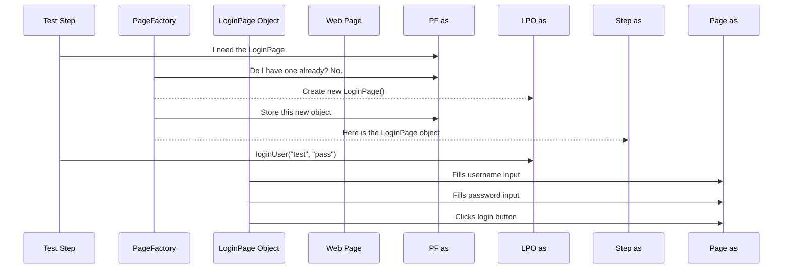

# Chapter 2: Page Object Model (POM)

In the [previous chapter](01_test_execution_configuration__cucumber__.md), we learned how to configure and run our tests using Cucumber profiles. We set up the "director's script" for our test suite. Now, let's look at how we organize the "actors"—the code that actually interacts with our web application.

### The Problem: A Messy Test Script

Imagine you're testing a login page. A typical test needs to:
1.  Find the username input field.
2.  Type a username into it.
3.  Find the password input field.
4.  Type a password into it.
5.  Find the "Sign In" button.
6.  Click the button.

Without a good design, your test step code might look like this:

```typescript
// The BAD way 👎
When('I log in', async function () {
  await this.page.getByPlaceholder("Username").fill("testuser");
  await this.page.getByPlaceholder("Password").fill("SuperSecret123");
  await this.page.locator("//button[text()='Sign In']").click();
});
```

This works, but it has a huge problem. What happens if a developer changes the placeholder text for the username field from "Username" to "Your Username"? **Every single test that uses that locator will break!** You would have to hunt through all your files and update the text everywhere. This is time-consuming and prone to errors.

### The Solution: The Page Object Model (POM)

The **Page Object Model (POM)** is a design pattern that solves this problem by creating a "map" or a "remote control" for each page of your web application.

**The core idea is simple:**
1.  For each page (e.g., Login Page, Home Page), create one corresponding file (e.g., `loginPage.ts`).
2.  Inside this file, store all the element locators (like CSS selectors or XPaths) for that page.
3.  Also inside this file, create methods that perform actions on that page (e.g., a `loginUser()` method).

This way, if a locator changes, you only need to update it in **one single place**: its page object file. Your tests remain unchanged.

### Breaking Down a Page Object: `loginPage.ts`

Let's look at a real example from our project. The `loginPage.ts` file acts as the "remote control" for our application's login screen. It has two main parts.

#### 1. The Elements: A Dictionary of Locators

First, we define all the locators for the page elements inside a single object. Think of this as the address book for everything on the login page.

**File:** `src/pages/login/loginPage.ts`
```typescript
export default class LoginPage extends BasePage {

    Elements = {
        url: process.env.BASEURL,
        userNameInput: "Username",
        passwordInput: "Password",
        loginBtn: 'Sign In',
        // ... other elements
    }
    // ... rest of the class
}
```
Here, `userNameInput` stores the placeholder text "Username". If this text ever changes on the website, we only need to update this one line of code.

#### 2. The Actions: Reusable Methods

Next, we create functions (methods) that perform actions using these elements. These are the "buttons" on our remote control.

Here's a simple method to type into the username field:

**File:** `src/pages/login/loginPage.ts`
```typescript
    async enterUserName(user: string) {
        await this.page.getByPlaceholder(this.Elements.userNameInput).fill(user);
    }
```
See how it uses `this.Elements.userNameInput`? It's looking up the address from our address book. This makes our code clean and easy to read.

We can combine these small actions into a larger, more convenient one:

**File:** `src/pages/login/loginPage.ts`
```typescript
    async loginUser(user: string, password: string) {
        await this.enterUserName(user);
        await this.enterPassword(password);
        await this.clickLoginButton();
    }
```
This `loginUser` method is incredibly useful. It hides all the details of filling in forms and clicking buttons. Now, our test step can just call this one simple method.

### How POM Cleans Up Our Tests

Let's revisit our test step. With POM, it becomes much simpler and more readable.

The step in our feature file might look like this:
```gherkin
When I log in as "testuser"
```

And the code for that step (the step definition) now looks like this:

```typescript
// The GOOD way 👍
import LoginPage from "../pages/login/loginPage"; // import the page object

When('I log in as {string}', async function (userDetail) {
  // We'll see how getPage works in a moment!
  const loginPage = await StepPageHelper.getPage(LoginPage);
  const userDetail = StepDataHelper.getSingleTestDataRecordForType(TestDataType.AppUser, userDetailDataPath) as AppUser; 
  await loginPage.loginUser(userDetail.username, userDetail.password);
});
```

This is a huge improvement!
*   **Readable:** It clearly states the intent: "log in the user".
*   **Maintainable:** It doesn't contain any brittle locators.
*   **Abstracted:** The step doesn't care *how* the login happens, only that it *does* happen. The `LoginPage` is responsible for the details.

### Under the Hood: The `PageFactory`

You might be wondering, "How does the test get the right Page Object?". We don't want to create a `new LoginPage()` in every single test step. That would be inefficient.

This is where the `PageFactory` comes in. Think of it as a librarian for Page Objects.

*   You ask the `PageFactory` for the `LoginPage`.
*   If it's the first time you've asked for it in this test, the factory creates a new `LoginPage` object for you.
*   It then "caches" it (keeps it on the desk).
*   The next time you ask for the `LoginPage`, the factory instantly gives you the one it already has.

This ensures we use the same page object throughout a test scenario, which is efficient and predictable.

Here is a simplified diagram of the flow:



The code for this in our project lives in `pageFactory.ts`. Here's a simplified look at its core method:

**File:** `src/pages/pageFactory.ts`
```typescript
export default class PageFactory {
    // A map to store the page objects we've already created
    private pages: Map<any, BasePage> = new Map();
    
    public async getPage<T extends BasePage>(pageClass: new () => T): Promise<T> {
        // 1. Check if we already have this page
        if (this.pages.has(pageClass)) {
            return this.pages.get(pageClass) as T;
        }
    
        // 2. If not, create a new one
        const newPage = new pageClass();

        // 3. Store it for next time
        this.pages.set(pageClass, newPage);
        return newPage;
    }
}
```

### The Foundation: `BasePage`

You may have noticed that `LoginPage` `extends BasePage`. A `BasePage` is like a blueprint for all our page objects. It contains common functionality that *any* page might need, like getting the current URL or checking for a loading spinner.

By having `LoginPage` inherit from `BasePage`, it gets all that shared functionality for free. This helps us avoid writing the same code over and over again.

#### Important: Implementing Abstract Methods

Since `BasePage` is an **abstract class**, it defines methods that *every* concrete page object (like `LoginPage`) **must implement**. These are "contracts" that ensure all pages follow the same pattern.

**Abstract Method: `isPageStable()`**

This method verifies that a page has fully loaded and is ready for user interactions. Since different pages have different stability criteria, each page must define its own implementation:

```typescript
// LoginPage must implement isPageStable()
export default class LoginPage extends BasePage {
    Elements = {
        loginBtn: 'Sign In',
        // ... other elements
    }
    
    // REQUIRED: Implement abstract method
    async isPageStable(): Promise<boolean> {
        // Wait for any ongoing operations to complete
        while (await this.sharedBehavior.isOperationInProgress());
        
        // Check if the login button is displayed
        return await this.pwWrapper.pageElement.isButtonDisplayed(this.Elements.loginBtn);
    }
    
    async loginUser(user: string, password: string) {
        await this.enterUserName(user);
        await this.enterPassword(password);
        await this.clickLoginButton();
    }
}
```

**Why is `isPageStable()` important?**
- It tells the framework when a page is ready for the next step
- The test framework automatically waits for the page to become stable before running the next action
- Different pages have different stability indicators (a dashboard might wait for charts to load, while a checkout page might wait for price calculations)

**Other BasePage Features:**
- `canNavigateWithUrl()`: Determines if the page can be navigated directly via URL (used for caching)
- `getCurrentPageURL()`: Gets the current page URL
- `waitUntilButtonIsDisplayed()`: Waits for a button to appear with retry logic
- `initialize()`: Called automatically when the page is first created

### Conclusion

You've just learned one of the most important concepts in test automation: the **Page Object Model (POM)**. It's the secret to writing tests that are clean, easy to read, and—most importantly—simple to maintain.

By organizing our code with POM, we:
*   **Centralize Locators:** Changes to the website UI only require updates in one place.
*   **Improve Readability:** Test steps become high-level and describe *what* is happening, not *how*.
*   **Promote Reusability:** Common actions (like logging in) can be reused across many different tests.

We now understand how to structure our page interactions. But what about managing the overall test flow? How do we ensure a browser is open *before* a test starts and closed *after* it finishes?

Next, we will dive into the mechanisms that control the setup and teardown of our tests in [Chapter 3: Test Lifecycle & Context (Hooks and Fixture)](03_test_lifecycle___context__hooks_and_fixture__.md).

---

Generated by [AI Codebase Knowledge Builder](https://github.com/The-Pocket/Tutorial-Codebase-Knowledge)