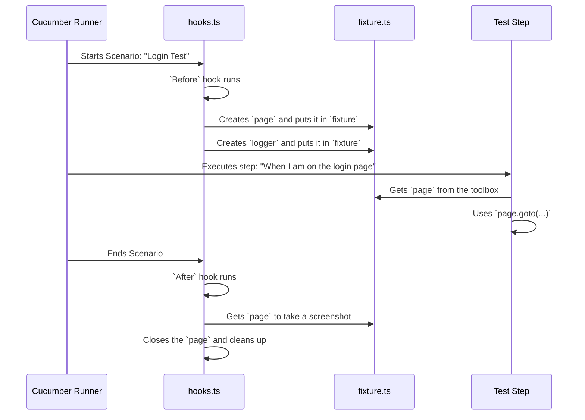

# Chapter 3: Test Lifecycle & Context (Hooks and Fixture)

In [Chapter 2: Page Object Model (POM)](02_page_object_model__pom__.md), we learned how to create clean, maintainable "remote controls" for our web pages. This keeps our test steps focused on *what* they are doing, not *how* they are doing it.

But a test needs more than just page interactions. Think about a play. Before the actors can perform, the stage crew needs to set up the lights, open the curtain, and place the props. After the scene, they need to clean up, change the set, and prepare for the next act. Who does this for our tests?

### The Problem: Repetitive Setup and Cleanup

Imagine you have 100 tests. For every single one, you need to:
1.  **Before the test:** Launch a new, clean browser window.
2.  **During the test:** Perform the test steps.
3.  **After the test:** Take a screenshot (especially if it failed), save a video of the run, and close the browser.

If you wrote this setup and cleanup code inside every test step, it would be a disaster. Your code would be incredibly repetitive, and a small change (like changing the screenshot folder) would require updating 100 different places.

### The Solution: The Stage Crew (Hooks) and The Toolbox (Fixture)

Our framework solves this with two powerful concepts that work together:

1.  **Cucumber Hooks (`Before` / `After`):** These are our automated "stage crew". They are special functions that Cucumber automatically runs before and after each test scenario. They handle all the repetitive setup and cleanup work without cluttering our tests.

2.  **The Fixture (`fixture.ts`):** This is our "shared toolbox". When the `Before` hook sets up the stage (e.g., creates a new browser page), it puts that page into the fixture. Then, during the test, our step definitions can simply open the toolbox and grab the page to work with. This ensures everyone—the setup, the test steps, and the cleanup—is using the exact same set of tools.

Let's see how they work together.

### Breaking Down the Test Lifecycle

Our entire test execution follows a predictable lifecycle, managed by the hooks in `hooks.ts`.

#### 1. Before It All Starts: `BeforeAll`

Once, at the very beginning of the entire test run, the `BeforeAll` hook runs. Its job is simple: get the theater ready. In our case, this means launching the browser application itself.

**File:** `src/hooks/hooks.ts`
```typescript
let browser: Browser;

BeforeAll(async function () {
    // This runs ONCE before all tests start
    getEnv(); // Loads environment variables
    browser = await invokeBrowser(); // Launches Chrome/Firefox/etc.
});
```
This code launches the browser (e.g., Chrome) and stores it in a `browser` variable. We only do this once to save time, rather than opening and closing the entire browser application for every single test.

#### 2. Before Each Scenario: `Before`

This is where the magic happens for each individual test. The `Before` hook is the stagehand that prepares a fresh, clean stage for every scene (scenario).

**File:** `src/hooks/hooks.ts`
```typescript
Before(async function ({ pickle }) {
    // 1. Create a unique name for logs, videos, etc.
    const scenarioName = pickle.name + "-" + Date.now();

    // 2. Create a new, isolated browser context and page
    context = await browser.newContext({
        recordVideo: { dir: `test-results/videos/${scenarioName}` },
    });
    const page = await context.newPage();
    
    // 3. Put the tools into the shared toolbox (fixture)
    fixture.page = page;
    fixture.logger = createLogger(options(scenarioName));
    fixture.dataBag = new DataBag(); // A fresh bag for test data
});
```
Here's what this stagehand does before every single scenario:
1.  **Gets a Unique Name:** It creates a unique name for the scenario run, like `Login_with_valid_credentials-1678886400000`, so that videos and logs don't overwrite each other.
2.  **Creates a Fresh Stage:** It uses the main `browser` to create a `newContext` and `newPage`. This is like getting a brand-new, perfectly clean browser window. It ensures that what you did in a previous test (like being logged in) doesn't affect the current one. It also starts the video recording here.
3.  **Fills the Toolbox:** It places the newly created `page`, a dedicated `logger`, and a fresh [DataBag (Scenario State Management)](05_databag__scenario_state_management__.md) into our shared `fixture` object.

#### 3. The Toolbox Itself: `fixture.ts`

So what does this `fixture` toolbox look like? It's surprisingly simple! It's just a plain object that holds references to all the important things a test might need.

**File:** `src/hooks/fixture.ts`
```typescript
import { Page, Logger, DataBag } from "...";

export const fixture = {
    page: undefined as Page,
    logger: undefined as Logger,
    dataBag: undefined as DataBag,
    // ... other useful things
};
```
Think of it as an empty toolbox before the test starts. The `Before` hook comes along and fills it with a shiny new `page`, `logger`, and `dataBag`.

#### 4. During the Test: Steps Use the Toolbox

Now, when our test steps run, they don't need to worry about creating a page or a logger. They just reach into the shared `fixture` toolbox and grab what they need.

Here's how a step definition uses the `page` that the `Before` hook prepared:

**File:** `src/tests/steps/loginSteps.ts` (Example)
```typescript
import { When } from "@cucumber/cucumber";
import { fixture } from "../../hooks/fixture";

When('I am on the login page', async function () {
    // Grab the page from the shared toolbox
    await navigateToLoginPage();
    fixture.logger.info("Navigated to the login page");
});
```
`src/pages/basePage.ts` (abstract) + `src/pages/login/loginPage.ts` (concrete)

```typescript
// ✅ ALL page objects MUST extend BasePage
// ✅ Properties: Elements = {}, pwWrapper, sharedBehavior
// ✅ Methods: Action-based (clickButton, enterText, etc.)
// ✅ NO assertions in page classes

export default class LoginPage extends BasePage {
    Elements = {
        url: process.env.BASEURL,
        element1: 'locator1',
        element2: 'locator2',
    }

    async isPageStable(): Promise<boolean> {
        // Return visibility of a key element
    }

    async actionMethod(): Promise<void> {
        // Use this.pwWrapper.dataWriter/dataReader/elementAction
        // NO direct page.click(), page.fill(), etc.
    }
    async navigateToLoginPage() {
        fixture.logger.info(`navigating to login page`);
        await this.pwWrapper.goto(this.Elements.url);
        fixture.logger.info(`login page navigation completed`); 
    }

}
```
It's that easy! The step trusts that the `fixture.page` has been perfectly prepared and is ready to use. This keeps our steps clean and focused on their specific task.

#### 5. After Each Scenario: `After`

Once the test is over (whether it passed or failed), our `After` hook runs to clean up the stage.

**File:** `src/hooks/hooks.ts`
```typescript
After(async function ({ result }) {
    // If the test passed, take a screenshot
    if (result?.status == Status.PASSED) {
        const img = await fixture.page.screenshot({ 
            path: `./test-results/screenshots/passed.png` 
        });
        this.attach(img, "image/png"); // Attach to the report
    }
    
    // Always clean up!
    await fixture.page.close();
    await context.close();
});
```
This cleanup crew does a few important jobs:
*   **Takes Evidence:** If the test passed, it takes a screenshot and attaches it to the final report. It also handles saving the video that was recorded.
*   **Cleans Up:** It closes the `page` and the `context`. This frees up resources and ensures the next test starts with a completely clean slate.

### Under the Hood: The Lifecycle Flow

Let's visualize the entire process for a single scenario.



This cycle repeats for every single scenario, ensuring each test is independent, gets the resources it needs, and is cleaned up properly afterward.

### Conclusion

You've just learned about the backbone of our test execution: the **Test Lifecycle**.

*   **Hooks (`Before`/`After`)** act as our automated "stage crew," handling all the repetitive setup and cleanup for our tests. This keeps our test logic clean and simple.
*   The **Fixture** acts as a "shared toolbox," allowing the hooks to prepare resources (like a browser page) and pass them seamlessly to the test steps.

This powerful combination ensures that our tests are robust, isolated, and easy to manage. We no longer have to worry about the boilerplate code of managing browsers; we can focus on writing great tests.

But how does the `invokeBrowser()` function in our `BeforeAll` hook actually launch a browser? That's the job of our browser interaction layer.

Next, we will explore the component responsible for communicating directly with Playwright to control the browser in [Chapter 4: Playwright Wrapper (Browser Interaction Layer)](04_playwright_wrapper__browser_interaction_layer__.md).

---

Generated by [AI Codebase Knowledge Builder](https://github.com/The-Pocket/Tutorial-Codebase-Knowledge)