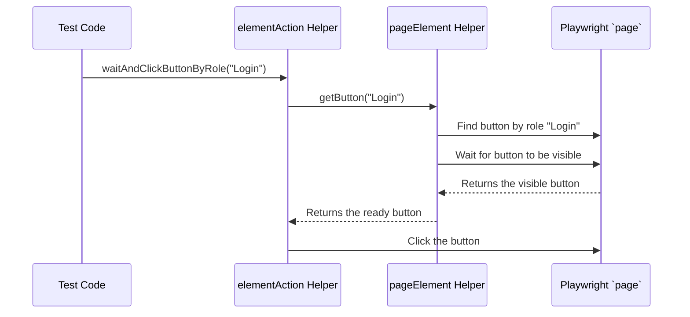

# Chapter 4: Playwright Wrapper (Browser Interaction Layer)

In the [previous chapter](03_test_lifecycle___context__hooks_and_fixture__.md), we learned how our "stage crew" (Hooks) sets up a fresh browser `page` for every test and places it in our shared toolbox (the Fixture). This gives every test step a clean environment to work in.

Now, we have our `page` object, which is Playwright's remote control for the browser. We could start using it directly in our tests, but this can lead to problems.

### The Problem: A Finicky and Repetitive Remote Control

Imagine you're using a universal remote for your TV. To turn on the TV and go to Netflix, you might have to press:
1.  `Power`
2.  Wait 5 seconds for the TV to boot up.
3.  `Input`
4.  `Down Arrow`
5.  `Down Arrow`
6.  `OK` to select HDMI 2.
7.  Wait 2 seconds for the input to switch.
8.  `Home` button on the streaming stick remote.
9.  `Right Arrow`
10. `OK` to select Netflix.

This is tedious! And what if the TV boots up a little slower today? Your sequence of button presses will fail. This is exactly what happens in test automation. A "raw" Playwright command to click a button might be simple, but a *reliable* click often needs more work.

```typescript
// The "raw" but fragile way 👎
await fixture.page.getByRole('button', { name: 'Login' }).click();
```

This code assumes the button is immediately ready. But what if the page is still loading? What if an animation is covering the button for a split second? The test will fail with a frustrating "element not found" or "element not clickable" error. To make it reliable, you'd have to add waits and checks *every single time you click something*.

```typescript
// The "raw" and reliable, but very repetitive way 👎
const loginButton = fixture.page.getByRole('button', { name: 'Login' });
await loginButton.waitFor({ state: 'visible' }); // Wait for it to appear
await loginButton.scrollIntoViewIfNeeded(); // Make sure it's on screen
await loginButton.click(); // NOW click it
```

Repeating this complex logic everywhere makes our tests messy, hard to read, and difficult to maintain.

### The Solution: A Simple, Smart Remote Control

This is where the **Playwright Wrapper** comes in. Think of it as a custom-built, smart remote control. Instead of a dozen confusing buttons, it has a few simple, powerful ones like "Go to Netflix". You press one button, and it automatically handles all the waiting and complex steps behind the scenes.

Our Playwright Wrapper is a collection of helper functions that bundle common, robust actions into simple, reusable methods.

Instead of the complex code above, we can just write this:

```typescript
// The wrapper way: simple, readable, and robust 👍
await this.wrapper.elementAction.waitAndClickButtonByRole('Login');
```

This single line of code does everything the repetitive version did: it finds the button, waits for it to be visible, and then clicks it. Our tests become cleaner, more readable, and far less likely to break due to timing issues.

### Breaking Down Our Smart Remote (The Wrapper)

Our "smart remote" is organized like a well-designed toolbox, with different compartments for different types of tools. This keeps our code organized. The main file is `playwrightWrappers.ts`, which acts as the entry point to all our helper tools.

Let's look at the different compartments:

*   **`elementAction`**: For performing actions like clicking buttons or links. (`pwWrapperElementAction.ts`)
*   **`dataWriter`**: For "writing" data to the page, like typing in a textbox or selecting from a dropdown. (`pwWrapperDataWriter.ts`)
*   **`dataReader`**: For "reading" data from the page, like getting the text of an element or the value of an input field. (`pwWrapperDataReader.ts`)
*   **`pageElement`**: A foundational helper responsible for *finding* elements on the page, with built-in waits to ensure they are ready. (`pwWrapperPageElement.ts`)

The main wrapper class simply creates an instance of each of these helpers, giving us easy access to them.

**File:** `src/helpers/wrapper/playwrightWrappers.ts`
```typescript
export default class PlaywrightWrapper {
    // Our compartments of tools
    dataReader: PlaywrightWrapperDataReader;
    dataWriter: PlaywrightWrapperDataWriter;
    elementAction: PlaywrightWrapperElementAction;
    pageElement: PlaywrightWrapperPageElement;
    // ... other helpers

    constructor(private page: Page) { 
        this.common = new PlaywrightWrapperCommon(this.page);
        this.pageElement = new PlaywrightWrapperPageElement(this.page, this.common);
        this.dataReader = new PlaywrightWrapperDataReader(this.page, this.common, this.pageElement);
        this.dataWriter = new PlaywrightWrapperDataWriter(this.page, this.common, this.pageElement);
        this.keyBoard = new PlaywrightWrapperKeyboard(this.page, this.common);
        this.elementAction = new PlaywrightWrapperElementAction(this.page, this.common, this.pageElement);
    }
}
```
When we use the wrapper in our tests, we can access any tool we need, like `wrapper.elementAction` or `wrapper.dataWriter`.

### Under the Hood: Tracing a Simple Click

Let's see what happens step-by-step when we call our smart remote's "click button" function: `wrapper.elementAction.waitAndClickButtonByRole('Login')`.

1.  Our test code calls the `waitAndClickButtonByRole` function in the `elementAction` helper.
2.  This function knows it shouldn't just click blindly. First, it asks another helper, `pageElement`, to find the button and make sure it's ready. It calls `pageElement.getButton('Login')`.
3.  The `getButton` function uses Playwright to locate the button, but then performs the most crucial step: **it waits for the element to be visible on the page**. This is the secret to making our tests stable.
4.  Once `getButton` confirms the button is visible, it returns the element back to `elementAction`.
5.  Now that `elementAction` has a visible, ready-to-go button, it safely calls the final `.click()` command.

This teamwork between the helpers ensures that every action is performed reliably.

Here's a diagram illustrating this flow:



#### Diving Into the Code

Let's look at the simplified code for this process.

First, the `elementAction` helper, which orchestrates the click.

**File:** `src/helpers/wrapper/pwWrapperElementAction.ts`
```typescript
export default class PlaywrightWrapperElementAction {
    // ... constructor ...

    async waitAndClickButtonByRole(btnName: string) {
        // 1. Ask the pageElement helper to find and wait for the button
        const element = await this.pageElement.getButton(btnName);
        
        // 2. Once we have it, click it!
        await element.click();
    }
}
```
You can see it delegates the hard work of finding the element to `this.pageElement`. Now, let's see the magic inside the `pageElement` helper.

**File:** `src/helpers/wrapper/pwWrapperPageElement.ts`
```typescript
export default class PlaywrightWrapperPageElement {
    // ... constructor ...

    async getButton(btnName: string): Promise<Locator> {
        // 1. Find the element using a standard Playwright locator
        const element = this.page.getByRole('button', { name: btnName });
        
        // 2. THIS IS THE SECRET! Wait for it to be visible.
        await element.waitFor({ state: 'visible' });
        
        // 3. Return the ready element
        return element;
    }
}
```
That simple `element.waitFor({ state: 'visible' })` is what makes the wrapper so powerful. By centralizing this logic here, we guarantee that *every* button click across our entire test suite will automatically wait for the button to be ready. If we ever need to change this logic (e.g., add more checks), we only need to do it in this one file.

### Conclusion

You've just learned about the **Playwright Wrapper**, our "smart remote" for browser interactions. It's a critical layer of abstraction that sits between our tests and the raw Playwright commands.

By using the wrapper, we gain enormous benefits:
*   **Robustness:** Tests are less "flaky" because actions like clicking and typing automatically wait for elements to be ready.
*   **Readability:** Our [Page Object Model (POM)](02_page_object_model__pom__.md) and test step files become much cleaner, using simple commands like `waitAndClickButtonByRole`.
*   **Maintainability:** The complex logic for interacting with the browser is in one central place. If a website behavior changes, we update the wrapper, not hundreds of tests.

We now have a reliable way to interact with web pages. But what happens when one test step needs to pass information to another? For example, Step 1 creates a new customer with a unique ID, and Step 2 needs to know that ID to find the customer on another page. How do we pass that data along?

Next, we will explore how we manage and share data within a single test scenario in [Chapter 5: DataBag (Scenario State Management)](05_databag__scenario_state_management__.md).

---

Generated by [AI Codebase Knowledge Builder](https://github.com/The-Pocket/Tutorial-Codebase-Knowledge)