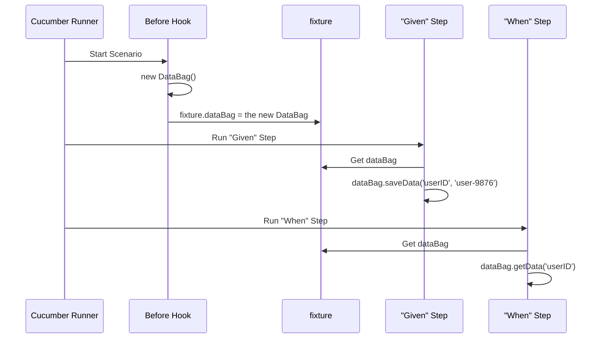

# Chapter 5: DataBag (Scenario State Management)

In the [previous chapter](04_playwright_wrapper__browser_interaction_layer__.md), we built a "smart remote" (our Playwright Wrapper) to make our interactions with the browser robust and simple. We now have a reliable way to perform actions like clicking buttons and filling out forms.

But what happens when one action creates a piece of information that a later action needs?

### The Problem: Steps Can't Talk to Each Other

Imagine you're testing an e-commerce site. Your test scenario might look like this:
1.  **Step 1:** Search for a product and add the first result to your cart. You get a unique Product ID, say "XYZ-123".
2.  **Step 2:** Navigate to the checkout page.
3.  **Step 3:** Verify that the product in your checkout summary is indeed "XYZ-123".

Here's the problem: in BDD frameworks like Cucumber, each step is designed to be isolated. The code for Step 3 has no idea what happened in Step 1. How can it possibly know that the Product ID it should be looking for is "XYZ-123"?

You could try to save it to a file, but that's slow and messy. How do we pass this little piece of information from one step to the next within the same test run?

### The Solution: A Shared Notepad (The DataBag)

This is where the `DataBag` comes in. Think of it as a **temporary, shared notepad** that is created for each individual scenario.

*   When Step 1 gets the Product ID, it "writes" it down on the notepad: `ProductID: "XYZ-123"`.
*   Later, when Step 3 needs to verify the product, it just "reads" from the same notepad to find the ID it's looking for.

This notepad is created fresh at the start of every scenario and thrown away at the end. This ensures that information from one test (e.g., "Login as an Admin") doesn't accidentally leak into the next test (e.g., "Try to log in as a guest").

### Using the DataBag: A Practical Example

Let's see how this works in our code. We'll use a simple scenario:
```gherkin
Scenario: Create and find a user
  Given I create a new user and get their user ID
  When I search for that user by their ID
  Then I should see the correct user details
```

#### Step 1: Writing to the Notepad (`saveData`)

The first step creates a user. Let's pretend the application gives us back a unique ID like `user-9876`. We need to save this ID so the next step can use it.

**File:** `src/tests/steps/userSteps.ts` (Example)
```typescript
import { Given } from "@cucumber/cucumber";
import { fixture } from "../../hooks/fixture";

Given('I create a new user and get their user ID', async function () {
  // Imagine we got a value: "user-9876" from the website and assigned it to newUserId
  fixture.logger.info(`New user created with ID: ${newUserId}`);

  // Write the user ID to our shared notepad (DataBag)
  fixture.dataBag.saveData('userID', newUserId);
});
```
This is the key line: `fixture.dataBag.saveData('userID', newUserId)`. We're giving our piece of data a "label" (`userID`) and storing the actual value (`"user-9876"`) in the DataBag.

#### Step 2: Reading from the Notepad (`getData`)

Now, the second step needs to find that user. It can ask the `DataBag` for the ID it needs.

**File:** `src/tests/steps/userSteps.ts` (Example)
```typescript
import { When } from "@cucumber/cucumber";
import { fixture } from "../../hooks/fixture";

When('I search for that user by their ID', async function () {
  // Read the user ID from our shared notepad
  const savedUserId = fixture.dataBag.getData('userID');

  fixture.logger.info(`Searching for user with ID: ${savedUserId}`);
  // Now, use 'savedUserId' to interact with the search page...
});
```
Here, `fixture.dataBag.getData('userID')` looks up the value associated with the `userID` label and returns it. The `savedUserId` variable now holds the value `"user-9876"`, and our step can continue its work. It's that simple!

### Under the Hood: How the Notepad is Managed

So where does this magical `DataBag` come from, and how is it kept separate for each scenario? The answer lies in our [Test Lifecycle & Context (Hooks and Fixture)](03_test_lifecycle___context__hooks_and_fixture__.md).

1.  **A Fresh Notepad is Prepared:** Before each scenario begins, our `Before` hook runs. One of its jobs is to create a brand-new, empty `DataBag` object.
2.  **It's Placed in the Toolbox:** This new `DataBag` instance is then placed into our shared `fixture` object.
3.  **Steps Use the Same Notepad:** Every step within that single scenario has access to the *same* `fixture`, so they are all reading and writing to the *same* `DataBag`.
4.  **It's Thrown Away:** When the scenario is over, the `After` hook cleans up, and the `fixture`'s contents (including our `DataBag`) are discarded. The next scenario will get its own fresh one.

This flow guarantees that data is shared correctly *within* a scenario but is perfectly isolated *between* scenarios.

Here's a diagram showing the lifecycle:


#### Diving Into the Code

The `DataBag` itself is incredibly simple. It's just a small class that manages a standard JavaScript object.

**File:** `src/helpers/util/dataBag.ts`
```typescript
export default class DataBag{
    private _dataBag = {};

    saveData(key: string, value: any){
        this._dataBag[key] = value;
    }

    getData(key:string){
        return this._dataBag[key];
    }
}
```
As you can see, `saveData` just adds an entry to an object, and `getData` retrieves it. There's no complex magic here, just a clean and simple pattern for state management.

And here is the line in our `Before` hook that gives every scenario a fresh start:

**File:** `src/hooks/hooks.ts`
```typescript
Before(async function ({ pickle, gherkinDocument }) {
    // ... other setup ...
    const dataBag = new DataBag();
    fixture.dataBag = dataBag; // A fresh notepad for this scenario
    // ... more setup ...
});
```
This single line is the key to ensuring each test is independent and doesn't interfere with others.

### Conclusion

You've just learned about the **DataBag**, our simple yet powerful tool for managing state within a test scenario.

By using the `DataBag`, we can:
*   **Pass data between steps:** Allow steps to communicate and build on each other's results.
*   **Keep tests isolated:** Ensure that data from one scenario never leaks into another.
*   **Write clean step definitions:** Avoid complex workarounds and keep our test code focused on its specific task.

The `DataBag` is perfect for handling data that is generated *during* a test. But what about data that is fixed for the environment you are testing against, like website URLs or login credentials for a specific test server? Manually changing these in the code for every test run would be a nightmare.

Next, we will explore how we manage different sets of test data and configurations for various environments (like QA, Staging, or Production) in [Chapter 6: Environment Configuration](06_environment_configuration_.md).

---

Generated by [AI Codebase Knowledge Builder](https://github.com/The-Pocket/Tutorial-Codebase-Knowledge)