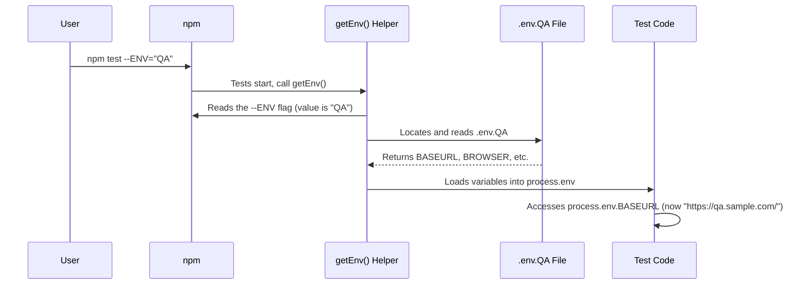

# Chapter 6: Environment Configuration

In the [previous chapter](05_databag__scenario_state_management__.md), we learned how to use the `DataBag` as a shared notepad to pass information between steps *within* a single test scenario. The `DataBag` is perfect for temporary data that your test generates.

But what about data that is constant for a specific testing environment, like a website URL or a database name? You wouldn't want to hard-code these values. If the QA team's URL changes, you'd have to edit your code in many places. This is a recipe for disaster.

### The Problem: One Test, Many Destinations

Imagine your test suite is an electric appliance, like a laptop charger. You need to travel and use it in different countries. The United States, Europe, and Australia all have different power outlets. You can't just plug your charger directly into the wall in every country; it won't fit.

Our tests are the same. We need to run them against different environments:
*   **QA1:** The main testing server (`https://qa1.myapp.com`)
*   **QA2:** A secondary server for new features (`https://qa2.myapp.com`)
*   **Staging:** A pre-production server (`https://staging.myapp.com`)

Each environment has a different "power socket"—a different URL, different login credentials, or a different database. How can we make our one "appliance" (our test suite) work in all these different "countries" (environments) without rewriting it every time?

### The Solution: A Set of Travel Adapters (`.env` files)

The solution is to use **environment configuration files**, which act like a set of travel adapters for our test suite.

For each environment (QA1, QA2, etc.), we create a simple text file that holds all the specific settings for that environment. These are our `.env` files.

*   `src/helpers/env/.env.QA1` contains settings for the QA1 server.
*   `src/helpers/env/.env.QA2` contains settings for the QA2 server.

When we want to run our tests, we simply tell the framework which "travel adapter" to use. The framework then automatically loads the correct settings, ensuring our tests "plug into" the right system.

### Breaking Down an Environment File

Let's look at one of our travel adapters. An `.env` file is just a list of key-value pairs.

**File:** `src/helpers/env/.env.QA1` (Simplified)
EXAMPLE :
```ini
# The main URL for the application
BASEURL=https://qa1.sample.com/

# The browser to use for tests
BROWSER=firefox

# The number of times to retry a failed test
CUCUMBER_RETRY_COUNT=2
```
This is simple and readable. If the URL for QA1 ever changes, you only need to update this one line in this one file. Your test code remains completely untouched.

Here's the adapter for our second environment:

**File:** `src/helpers/env/.env.QA2` (Simplified)
EXAMPLE:
```ini
# The main URL for the application
BASEURL=https://qa2.sample.com/

# The browser to use for tests
BROWSER=chrome

# The number of times to retry a failed test
CUCUMBER_RETRY_COUNT=0
```
Notice that not only is the `BASEURL` different, but we've also configured this environment to run tests in `chrome` and not to retry failed tests. This flexibility is incredibly powerful.

### How to Use the Adapters

So, how do we tell our test suite which environment to run against? We do it with a simple flag in our command line when we run the tests.

To run against the **QA1** environment:
```bash
npm test --ENV="QA1"
```

To run against the **QA2** environment:
```bash
npm test --ENV="QA2"
```

The `--ENV="QA2"` part is the instruction that tells our framework: "Before you do anything else, go grab the `.env.QA2` travel adapter and plug it in!"

Once the correct file is loaded, these values become available everywhere in our code through a special object called `process.env`. For example, `process.env.BASEURL` will automatically hold the correct URL for the chosen environment.

Here is how a Page Object might use it:
**File:** `src/pages/login/loginPage.ts` 
```typescript
// In some page object...
async navigateToLoginPage() {
        fixture.logger.info(`navigating to login page`);
        await this.pwWrapper.goto(this.Elements.url);
        fixture.logger.info(`login page navigation completed`); 
    }
```
**File:** `src/helpers/wrapper/playwrightWrappers.ts` 
```tyepscript
async goto(url: string, timeout: number = 20000) {
        await this.page.goto(url, {
            waitUntil: BrowserEvents.PAGE_LOADED,
            timeout: timeout
        });
    }
```
### Under the Hood: The Loading Mechanism

How does this loading process happen automatically? It's handled by a helper function that runs at the very beginning of our test execution.
EXAMPLE:
1.  When you run the command `npm test --ENV="QA"`.
2.  Before any tests start, our `BeforeAll` hook from [Chapter 3: Test Lifecycle & Context (Hooks and Fixture)](03_test_lifecycle___context__hooks_and_fixture__.md) calls a function named `getEnv()`.
3.  The `getEnv()` function looks at the command you ran and finds the `--ENV` flag. It sees the value is `"QA"`.
4.  It constructs the path to the correct file: `src/helpers/env/.env.QA`.
5.  It uses a special library called `dotenv` to read this file and load all its key-value pairs into the global `process.env` object.
6.  From this point on, any part of the code can access `process.env.BASEURL` or `process.env.BROWSER` and get the values specific to the QA environment.

Here is a diagram showing the flow for the above example:



#### Diving Into the Code

Let's look at the simplified helper function that makes this all possible.

**File:** `src/helpers/env/env.ts`
```typescript
import * as dotenv from 'dotenv'

export const getEnv = () => {
    // 1. Get the environment name from the command line
    const envName = process.env.npm_config_ENV || "QA1";

    // 2. Build the path to the correct .env file
    const envPath = `src/helpers/env/.env.${envName}`;

    // 3. Load the file's contents into process.env
    dotenv.config({
        override: true,
        path: envPath
    });
}
```
This small function is the heart of our environment configuration.
1.  It checks for the `npm_config_ENV` variable, which is how `npm` passes the `--ENV` flag to our code. If it's not found, it defaults to `"QA1"`.
2.  It creates the full path to the file.
3.  It calls `dotenv.config()` to do the heavy lifting of loading the variables. The `override: true` option ensures that these settings take precedence.

### Managing Static Test Data with Environment Variables

While the `.env` files handle environment-specific settings like URLs and browser preferences, there's another critical use case: **static test data** that doesn't change during a test run but varies by environment (like login credentials, test user information, or form data).

#### The Problem: Hardcoded Test Data

In Chapter 5, we learned that the `DataBag` is perfect for *dynamic* data generated during test execution. But what about *static* test data—information that is fixed and reusable across multiple test runs?

You might be tempted to hardcode it directly in your step definitions:

```typescript
// ❌ BAD: Hardcoded data
And('I log in as admin', async function () {
    await loginPage.enterUserName('admin@example.com');  // ❌ Hardcoded!
    await loginPage.enterPassword('password123');         // ❌ Hardcoded!
});
```

This approach has serious problems:
- If you have 50 test scenarios, you now have 50 different places to update when the test password changes.
- You can't easily switch between different test users (admin, guest, customer, etc.).
- Test data is mixed with test logic, making the code harder to maintain.

#### The Solution: Separate Test Data Files + Environment Paths

The solution is to **store test data in external JSON files and reference them via environment variables**—just like your configuration settings.

Here's the pattern:

1. **Create a Test Data JSON File**
2. **Add the File Path to Your `.env` File**
3. **Create a Type Model for the Data**
4. **Load the Data in Step Definitions Using a Helper**

#### Step 1: Create Local Test Data JSON Files

Store your static test data in the `test-data-store/` folder. These are **local data files** containing pre-defined test values that live in your repository, not data from the application or API responses.

Structure test data to match your features:

Example :

**File:** `test-data-store/login/loginUser.json`
```json
{
  "appAdminUser": {
    "userName": "admin@example.com",
    "password": "SecureAdminPass123!",
    "fullUserName": "Admin User"
  },
  "appGuestUser": {
    "userName": "guest@example.com",
    "password": "GuestPass456!",
    "fullUserName": "Guest User"
  },
  "appCustomerUser": {
    "userName": "customer@example.com",
    "password": "CustomerPass789!",
    "fullUserName": "Customer User"
  }
}
```

Example :

**File:** `test-data-store/farmAssessment/farmData.json`
```json
{
  "tropical2004Assessment": {
    "year": "2004",
    "climate": "tropical",
    "fileType": "ATS FILE",
    "lactatingCows": "123"
  },
  "temperate2015Assessment": {
    "year": "2015",
    "climate": "temperate",
    "fileType": "ATS FILE",
    "lactatingCows": "456"
  }
}
```

#### Step 2: Add File Paths to `.env`

In your environment configuration files, add the paths to your local test data files. This allows you to:
- Keep data file paths in one place
- Switch between different test data sets without modifying code
- Maintain all environment configuration centrally

Example :

**File:** `src/helpers/env/.env.QA1`
```ini
BASEURL=https://qa1.sample.com/
BROWSER=firefox
CUCUMBER_RETRY_COUNT=2
LOGIN_USER_DATA=test-data-store/login/loginUser.json
FARM_DATA_FILE=test-data-store/farmAssessment/farmData.json
```
Example :

**File:** `src/helpers/env/.env.QA2`
```ini
BASEURL=https://qa2.sample.com/
BROWSER=chrome
CUCUMBER_RETRY_COUNT=0
LOGIN_USER_DATA=test-data-store/login/loginUser.json
FARM_DATA_FILE=test-data-store/farmAssessment/farmData.json
```

Notice:
- The file paths can point to the same test data across environments
- Or you could point to different data files for different environments if needed
- All configuration is in `.env` files, keeping test code clean

#### Step 3: Create a Type Model for Test Data

Create TypeScript models/interfaces to represent your test data. This provides type safety and makes your test code more readable.

Example :

**File:** `src/helpers/util/test-data/account/appUser.ts`
```typescript
/**
 * **WHAT:** Data model representing user credentials for login tests
 * 
 * **WHY:** Type-safe TypeScript interface for user data loaded from local JSON test data files
 * 
 * **WHERE USED:**
 * - Login step definitions
 * - Local test data files: test-data-store/login/loginUser.json
 * - StepDataHelper.getSingleTestDataRecordForType(TestDataType.AppUser, ...)
 * 
 * **WHEN TO USE:**
 * - Loading user credentials from local test data (not from API/application)
 * - Providing type-safe access to user properties in step definitions
 * - Running tests with different user accounts from JSON files
 * 
 * **PROPERTIES:**
 * - userName: User's login username/email
 * - password: User's login password
 * - fullUserName: User's full display name
 * 
 * @example
 * // In local test data JSON file: test-data-store/login/loginUser.json
 * {
 *   "appAdminUser": {
 *     "userName": "admin@example.com",
 *     "password": "AdminPass123!",
 *     "fullUserName": "Admin User"
 *   }
 * }
 * 
 * @example
 * // In step definition - loading from local JSON file
 * import AppUser from '../../helpers/util/test-data/account/appUser';
 * const user = StepDataHelper.getSingleTestDataRecordForType(
 *   TestDataType.AppUser,
 *   'json://LOGIN_USER_DATA#appAdminUser'
 * ) as AppUser;
 * // LOGIN_USER_DATA path comes from .env file pointing to local JSON
 * await loginPage.enterUserName(user.userName);
 * await loginPage.enterPassword(user.password);
 */
export default class AppUser {
    userName: string;
    password: string;
    fullUserName: string;
}
```

Similarly, for farm assessment data:

**Example File:** `src/helpers/util/test-data/farm/farmData.ts`
```typescript
/**
 * **WHAT:** Data model representing farm assessment form test data
 * 
 * **WHY:** Type-safe TypeScript interface for form inputs loaded from local JSON test data files
 * 
 * **WHERE USED:**
 * - Farm assessment step definitions
 * - Local test data files: test-data-store/farmAssessment/farmData.json
 * - StepDataHelper.getSingleTestDataRecordForType(TestDataType.FarmAssessment, ...)
 * 
 * **WHEN TO USE:**
 * - Filling farm assessment forms with pre-defined test data
 * - Running form submission tests with different data sets
 * - Validating form field population with test values
 * 
 * **PROPERTIES:**
 * - year: Year being evaluated (dropdown value from test data)
 * - climate: Climate type (dropdown value from test data)
 * - fileType: File type selection (radio button value from test data)
 * - lactatingCows: Number of lactating cows (input field value from test data)
 * 
 * @example
 * // In local test data JSON: test-data-store/farmAssessment/farmData.json
 * {
 *   "tropical2004Assessment": {
 *     "year": "2004",
 *     "climate": "tropical",
 *     "fileType": "ATS FILE",
 *     "lactatingCows": "123"
 *   }
 * }
 * 
 * @example
 * // In step definition - loading from local JSON file
 * import FarmAssessmentData from '../../helpers/util/test-data/farm/farmData';
 * const farmData = StepDataHelper.getSingleTestDataRecordForType(
 *   TestDataType.FarmAssessment,
 *   'json://FARM_DATA_FILE#tropical2004Assessment'
 * ) as FarmAssessmentData;
 * // FARM_DATA_FILE path comes from .env file pointing to local JSON
 */
export default class FarmAssessmentData {
    year: string;
    climate: string;
    fileType: string;
    lactatingCows: string;
}
```

#### Step 4: Load Data in Step Definitions

Now, in your step definitions, load the test data using a helper method. This approach gives you:
- ✅ Type safety (TypeScript knows the structure)
- ✅ No hardcoded data (external JSON files)
- ✅ Environment flexibility (via `.env` file paths)
- ✅ Reusability (same data used across multiple scenarios)

**Example File:** `src/tests/steps/loginSteps.ts`
```typescript
import { Given } from "@cucumber/cucumber";
import { fixture } from "../../hooks/fixture";
import StepPageHelper from "../stepPageHelper";
import StepDataHelper from "../../helpers/util/stepDataHelper";
import { TestDataType } from "../../helpers/util/test-data/testDataType";
import AppUser from "../../helpers/util/test-data/account/appUser";

Given('logs-in as {string}', async function (userDataPath: string) {
  const loginPage = await StepPageHelper.getLoginPage();

    // Load user data from LOCAL JSON file (test-data-store/login/loginUser.json)
    // The file path is referenced in .env: LOGIN_USER_DATA=test-data-store/login/loginUser.json
    // userDataPath format from feature: "json://LOGIN_USER_DATA#appAdminUser"
    const user = StepDataHelper.getSingleTestDataRecordForType(
        TestDataType.AppUser,
        userDataPath
    ) as AppUser;

    fixture.logger.info(`Logging in as: ${user.fullUserName}`);

    await loginPage.enterUserName(user.userName);
    await loginPage.enterPassword(user.password);
    await loginPage.clickLoginButton();

    // Save logged-in user info to DataBag for use in later steps
    fixture.dataBag.saveData('loggedInUser', user.fullUserName);
});
```

**Example File:** `src/tests/steps/farmAssessmentSteps.ts`
```typescript
import { And } from "@cucumber/cucumber";
import { fixture } from "../../hooks/fixture";
import StepPageHelper from "../stepPageHelper";
import StepDataHelper from "../../helpers/util/stepDataHelper";
import { TestDataType } from "../../helpers/util/test-data/testDataType";
import FarmAssessmentData from "../../helpers/util/test-data/farm/farmData";

And('I fill farm assessment with {string}', async function (farmDataPath: string) {
    const assessmentPage = await StepPageHelper.getFarmAssessmentPage();
    
    // Load farm data from LOCAL JSON file (test-data-store/farmAssessment/farmData.json)
    // The file path is referenced in .env: FARM_DATA_FILE=test-data-store/farmAssessment/farmData.json
    // farmDataPath format from feature: "json://FARM_DATA_FILE#tropical2004Assessment"
    const farmData = StepDataHelper.getSingleTestDataRecordForType(
        TestDataType.FarmAssessment,
        farmDataPath
    ) as FarmAssessmentData;

    fixture.logger.info(`Filling farm assessment with: Year=${farmData.year}, Climate=${farmData.climate}`);

    await assessmentPage.selectYearEvaluated(farmData.year);
    await assessmentPage.selectClimate(farmData.climate);
    await assessmentPage.selectFileTypeATS();
    await assessmentPage.enterLactatingCows(farmData.lactatingCows);
    
    // Save form data to DataBag for use in later steps (dynamic scenario data)
    fixture.dataBag.saveData('submittedFarmData', farmData);
});
```

#### Using Test Data in Feature Files

In your Gherkin feature files, reference the test data using the URI format:

**Example File:** `src/tests/features/login.feature`
```gherkin
@login @smoke
Scenario: Admin user logs in successfully
  Given logs-in as "json://LOGIN_USER_DATA#appAdminUser"
  Then I should see the dashboard
```

**Example File:** `src/tests/features/farmAssessment.feature`
```gherkin
@farmAssessment @smoke
Scenario: User completes farm assessment
  Given I am logged in
  When I click on a farm card
  And I fill farm assessment with "json://FARM_DATA_FILE#tropical2004Assessment"
  And I click the save button
  Then I should see "HERD DETAILS" text visible
```

#### Key Differences: DataBag vs. Local Test Data Files

This is an important distinction to understand:

| Aspect | DataBag (Chapter 5) | Local Test Data Files (This Section) |
|--------|-------------------|------------------------------|
| **Purpose** | Store *dynamic* data generated during test execution | Store *static* test data that's pre-defined and reusable |
| **When to Use** | Data extracted/generated from current test run | Login credentials, form test values, test constants |
| **Lifetime** | Fresh for each scenario, discarded at end | Lives in repository, persists across test runs |
| **Location** | In memory (created during `Before` hook) | Local JSON files in `test-data-store/` folder |
| **Definition** | Created dynamically by test code during execution | Pre-defined in JSON files before tests run |
| **Example** | `fixture.dataBag.saveData('newUserId',userId)` | `"json://LOGIN_USER_DATA#appAdminUser"` from local JSON |

### Conclusion

You've just learned how our framework handles **Environment Configuration** and **Local Test Data Management**. This powerful two-part system allows us to write maintainable, reusable tests that are:

*   **Data-driven:** Test data is separated from test logic
*   **Environment-agnostic:** The same tests run across different environments
*   **Non-hardcoded:** All static test data lives in external JSON files
*   **Type-safe:** TypeScript models ensure data structure correctness
*   **Reusable:** Multiple scenarios can share the same test data

By using this comprehensive approach, we:
*   **Decouple Configuration from Code:** Our test logic doesn't contain any hard-coded URLs, passwords, or test data.
*   **Manage Local Test Data Separately:** Test data lives in external JSON files, not scattered across step definitions.
*   **Enable Type Safety:** TypeScript models ensure test data structure correctness and IDE autocomplete support.
*   **Support Environment Flexibility:** The same tests run across different environments with proper configuration.
*   **Simplify Maintenance:** When test data changes, update the JSON file once instead of modifying multiple step definitions.
*   **Improve Reusability:** Multiple scenarios can reference the same local test data without duplication.

Now that we can run our tests against any environment with proper test data and gather the results, the next logical step is to present those results in a way that's easy for everyone on the team—developers, managers, and testers—to understand.

Next, we will look at how we transform the raw test output into a user-friendly, interactive report in [Chapter 7: Custom HTML Reporting](07_custom_html_reporting_.md).

---

Generated by [AI Codebase Knowledge Builder](https://github.com/The-Pocket/Tutorial-Codebase-Knowledge)