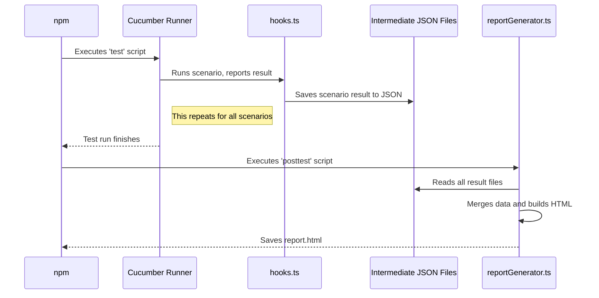

# Chapter 7: Custom HTML Reporting

In the [previous chapter](06_environment_configuration_.md), we learned how to use "travel adapters" (`.env` files) to run our tests against different environments. This gives us the power to execute our test suite anywhere. But once the tests are finished, what do we do with the results? Looking at lines of text in a terminal window isn't very helpful for a team.

### The Problem: A Raw, Unreadable Scoreboard

Imagine a professional basketball game. The game ends, and the only record you get is a raw text file from the scorekeeper's computer:

```
12:00 Q1 JUMP_BALL
11:45 Q1 PLAYER_A SCORE 2PT
11:20 Q1 PLAYER_B FOUL
...
00:01 Q4 PLAYER_X SCORE 3PT
FINAL_SCORE: 101-98
```

Is this useful? Barely. It's hard to read, you can't see the big picture, and you can't easily share it with the coach or the fans. What you really want is the ESPN game summary: a beautiful dashboard with the final score, key player stats, a shot chart, and video highlights.

Our test results are the same. The raw output from Cucumber is just a stream of text. It's not a "trophy case" we can show off or a "game summary" the whole team can use to understand the health of our application.

### The Solution: Our Custom Trophy Case and Game Summary

To solve this, our framework has a built-in **Custom HTML Reporter**. After all the tests have finished running, a special script gathers all the raw data—which tests passed, which failed, and which were retried—and generates a single, beautiful, interactive HTML file.

This isn't just a log file; it's a dashboard that provides:
*   A high-level overview of the test run's health.
*   The ability to filter for failed or retried tests.
*   A searchable list of all scenarios.
*   A clear, shareable artifact for everyone on the team.

### How It Works: The Reporting Pipeline

Generating this report is an automated, three-step process that happens every time you run `npm test`.

1.  **The Game (`npm test`):** You run your tests. As each test (scenario) finishes, our "scorekeeper" takes notes.
2.  **The Scorekeeper (`hooks.ts`):** Our [Test Lifecycle & Context (Hooks and Fixture)](03_test_lifecycle___context__hooks_and_fixture__.md) acts as the scorekeeper. In the `After` hook, it doesn't just clean up; it records the result of the scenario (pass/fail, duration, retries) into simple JSON files inside the `test-results` folder.
3.  **The Broadcaster (`npm posttest`):** Once all tests are done, `npm` automatically runs a special script called `posttest`. This script is our "broadcaster"—it executes the `reportGenerator.ts` file, which reads all the JSON score sheets and builds the final HTML dashboard.

Let's look at the commands that orchestrate this.

**Example File:** `package.json`
```json
"scripts": {
  "test": "cucumber-js --config=config/cucumber.js || true",
  "posttest": "npx ts-node src/helpers/report/reportGenerator.ts"
}
```
*   `test`: This is the command that runs our Cucumber tests.
*   `posttest`: This is a special `npm` feature. It automatically runs *after* the `test` script is finished. It's the perfect place to put our report generation logic.

### Under the Hood: Tracing the Data Flow

Let's follow the journey of a single test result from execution to the final report.

1.  The `npm test` command starts the Cucumber runner.
2.  Cucumber runs a scenario. Let's say "Login with valid credentials" passes.
3.  The `After` hook in `hooks.ts` catches this result. It records the scenario's name, status ("passed"), and duration into a temporary data structure.
4.  After all tests are done, the `AfterAll` hook writes this collected data into `test-results/passed-scenarios.json`. If any tests failed their final retry attempt, they are written to separate files in `test-results/failed/`.
5.  The `test` script finishes.
6.  `npm` sees the `posttest` script and immediately runs it.
7.  The `reportGenerator.ts` script starts. It reads `passed-scenarios.json` and all the files in the `failed` directory.
8.  It merges this data together and injects it into an HTML template.
9.  Finally, it saves the complete HTML string as `test-results/report.html`.

Here is a diagram of this reporting pipeline:



### Diving Into the Code: The Report Generator

The heart of this process is the `reportGenerator.ts` script. Let's look at a simplified version of what it does.

#### 1. Reading the Score Sheets

First, the generator needs to find and read the JSON files that our hooks created.

**File:** `src/helpers/report/reportGenerator.ts` (Simplified)
```typescript
class ReportGenerator {
    private passedFeatures: Feature[];
    private failedFeatures: Feature[];

    constructor() {
        // Read the JSON file for all passed tests
        this.passedFeatures = fs.readJsonSync('test-results/passed-scenarios.json');
        
        // Find and read all the JSON files for failed tests
        this.failedFeatures = this.loadFailedFeatures('test-results/failed');
    }
    // ... more methods
}
```
This code uses a library to easily read the JSON files and store the data in memory, ready to be processed.

#### 2. Building the HTML

Next, the generator takes this data and builds the HTML page. It uses a modern JavaScript feature called "template literals" (the backtick `` ` `` character) to easily mix HTML structure with our test data.

**File:** `src/helpers/report/reportGenerator.ts` (Simplified)
```typescript
    private generateHtml(features: Feature[]): string {
        const totalScenarios = features.flatMap(f => f.scenarios).length;
        const failedScenarios = features.flatMap(f => f.scenarios)
                                        .filter(s => s.status === 'failed').length;

        // The HTML structure uses variables like ${totalScenarios}
        return `
    <!DOCTYPE html>
    <html>
    <head><title>Test Report</title></head>
    <body>
        <h1>Test Run Summary</h1>
        <div class="card">
            <div>Total Scenarios</div>
            <div class="value">${totalScenarios}</div>
        </div>
        <div class="card">
            <div>Failed Scenarios</div>
            <div class="value">${failedScenarios}</div>
        </div>
        <!-- ... more HTML and data ... -->
    </body>
    </html>`;
    }
```
This snippet shows how simple variables like `totalScenarios` are injected directly into the HTML string. The actual file does this for every feature and scenario to build the full, detailed list.

The final step is simply to write this generated HTML string to a file, which completes the process.

### Conclusion

You've just learned about our **Custom HTML Reporter**, the system that transforms raw, hard-to-read test output into a valuable, interactive dashboard for the entire team.

We saw how:
*   The `posttest` script in `package.json` provides a hook to run code after our tests are complete.
*   Our `hooks.ts` file acts as a "scorekeeper," saving structured test results to intermediate JSON files.
*   A dedicated `reportGenerator.ts` script acts as a "broadcaster," consuming this data to produce a final, user-friendly `report.html`.

This reporting system is the final piece of our local test automation puzzle. We can now configure our tests for any environment, run them, and get a beautiful report. But how do we take this out of our local machines and make it run automatically whenever code changes?

Next, we will explore how to integrate our test suite into an automated pipeline for continuous integration and delivery in [Chapter 8: CI/CD Pipeline](08_ci_cd_pipeline_.md).

---

Generated by [AI Codebase Knowledge Builder](https://github.com/The-Pocket/Tutorial-Codebase-Knowledge)