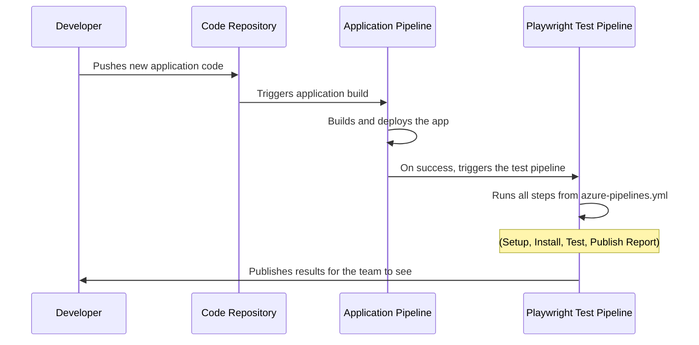

# Chapter 8: CI/CD Pipeline

In the [previous chapter](07_custom_html_reporting_.md), we learned how to generate a beautiful, interactive HTML report from our test results. We can now run our tests on our own computer and get a shareable dashboard. This is great, but it's still a manual process. Someone has to remember to run the tests.

What if we could build an automated assembly line that runs our entire test suite every single time a developer makes a change to the main application?

### The Problem: Manual, Inconsistent Testing

Imagine you're part of a car manufacturing team. Every time a new engine part is designed, someone has to manually take it to a test bench, hook it up, run it, and write down the results. This is slow, error-prone, and inconsistent. What if the person testing it today runs a different test than the person who tested it yesterday?

Running tests on our local machines is exactly like this. It's manual, it relies on one person's machine being set up correctly, and it doesn't happen automatically. This is not a reliable way to ensure the quality of our application.

### The Solution: An Automated Assembly Line

A **CI/CD Pipeline** (Continuous Integration / Continuous Delivery) is our automated assembly line. It's a process that runs on a remote, neutral server (like Azure DevOps or GitHub Actions) that automatically performs a series of steps every time it's triggered.

The blueprint for this assembly line is our `azure-pipelines.yml` file. Think of it as a detailed recipe that tells a robot chef *exactly* how to cook a dish from scratch, every single time, with no mistakes. It ensures our tests are run in a clean, consistent environment without any human intervention.

### Breaking Down the Blueprint (`azure-pipelines.yml`)

Our pipeline's "recipe" has several key steps. Let's walk through them one by one.

#### Step 1: Prepare the Kitchen (Set up the Environment)

First, we need a clean kitchen to work in. This part of the file tells the remote server what kind of computer to use and what basic software to install.

**File:** `azure-pipelines/playwright.yml`
```yaml
jobs:
  - job: Test_Sample_App_UI
    pool:
      vmImage: "windows-latest" # 1. Get a fresh Windows machine
    
    steps:
      - task: NodeTool@0 # 2. Install Node.js
        inputs:
          versionSpec: "22.13.1"
```
1.  **`vmImage`**: This line is like ordering a brand-new, clean computer. We're asking for the latest version of Windows to run our tests on. This ensures we start from a predictable state every time.
2.  **`NodeTool@0`**: This installs Node.js, which is the engine required to run all our JavaScript/TypeScript code and test commands.

#### Step 2: Gather the Ingredients (Install Dependencies)

Now that the kitchen is ready, we need to get our project's specific ingredients. This means installing all the libraries and tools our project depends on.

**File:** `azure-pipelines/playwright.yml`
```yaml
      - script: |
          npm install
        displayName: "Install dependencies"

      - script: |
          npx playwright install --with-deps
        displayName: "Install Playwright Browsers"
```
*   **`npm install`**: This command reads our `package.json` file and downloads all the necessary libraries (like Cucumber and Playwright) into a `node_modules` folder.
*   **`npx playwright install`**: This is a special Playwright command that downloads the actual web browsers (like Chrome, Firefox, and WebKit) that our tests will control.

#### Step 3: Run the Recipe (Execute the Tests)

The kitchen is prepped, and all ingredients are ready. It's time to run the tests!

**File:** `azure-pipelines/playwright.yml`
```yaml
      - script: |
          npm test
        displayName: "Run Playwright tests"
```
This is the moment of truth. The pipeline runs the exact same `npm test` command we use on our local machines. The remote server will now execute our Cucumber scenarios, open browsers, interact with the application, and generate results.

#### Step 4: Plate the Dish (Publish the Results)

Our tests have finished, and the `test-results` folder now contains our beautiful HTML report and other data. The final step is to "plate the dish"—to save these results so the team can see them.

**File:** `azure-pipelines/playwright.yml`
```yaml
      - publish: $(System.DefaultWorkingDirectory)/test-results
        artifact: test-report
        condition: always()

      - task: PublishHtmlReport@1
        inputs:
          reportDir: '$(System.DefaultWorkingDirectory)/test-results/report.html'
```
*   **`publish`**: This step takes our entire `test-results` folder and saves it as an "artifact." An artifact is just any file or folder produced by the pipeline that we want to keep. `condition: always()` ensures this happens even if some tests failed, which is crucial for debugging.
*   **`PublishHtmlReport@1`**: This is a special task that knows how to find our `report.html` and display it in a nice, user-friendly tab directly within the Azure DevOps pipeline results page.

### The Magic Start Button: The Trigger

So what kicks off this entire assembly line? A **trigger**. Our pipeline is configured to listen for changes in another pipeline—the one that builds our main application.

**File:** `azure-pipelines/playwright.yml`
```yaml
resources:
  pipelines:
  - pipeline: Actual_Application_Pipeline
    source: Actual\Application\Pipeline\Web App Name
    trigger: true
```
This block of code sets up a simple but powerful rule: "Watch the main application's build pipeline. The moment it successfully finishes building a new version of the app, automatically **trigger** this testing pipeline."

This is the heart of **Continuous Integration**:
1.  A developer pushes new code for the application.
2.  The application pipeline automatically builds it.
3.  Our test pipeline automatically runs against that new build.

The team gets immediate feedback on whether the new code broke anything.

### Under the Hood: The Full CI/CD Flow

Let's visualize the entire automated process from start to finish.



### Conclusion

You have now reached the end of the `Playwright_demo` tutorial! You've learned about the final and most critical piece of modern test automation: the **CI/CD Pipeline**.

This automated assembly line, defined by the `azure-pipelines.yml` blueprint, takes our entire test suite and makes it a fully automated, hands-off process. It ensures that every change to our application is rigorously tested in a clean, consistent environment, providing a powerful safety net for the entire development team.

Throughout this series, you have journeyed from the ground up:
*   You started by configuring how to run tests with **Cucumber Profiles**.
*   You organized your code cleanly with the **Page Object Model**.
*   You managed the test lifecycle with **Hooks and Fixtures**.
*   You built a robust **Playwright Wrapper** for stable browser interactions.
*   You passed data between steps using the **DataBag**.
*   You configured your tests for different servers with **Environment Files**.
*   You created a beautiful **Custom HTML Report**.
*   And finally, you automated the entire process in a **CI/CD Pipeline**.

Congratulations! You now have a comprehensive understanding of the key concepts that make a test automation framework powerful, maintainable, and effective. You are well-equipped to write, run, and automate tests for any web application.

---

Generated by [AI Codebase Knowledge Builder](https://github.com/The-Pocket/Tutorial-Codebase-Knowledge)