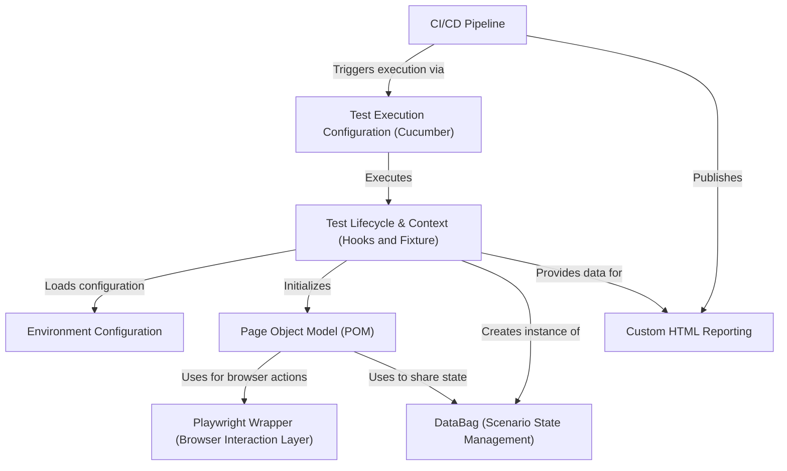

# Tutorial: Playwright_demo

This project is a robust *test automation framework* for web applications, using **Playwright** for browser control and **Cucumber** for writing tests in a human-readable format. It provides a complete solution for testing: from *configuring different environments* and managing the test lifecycle, to interacting with web pages through a structured **Page Object Model (POM)**. After the tests run, it generates a custom, user-friendly *HTML report* and is fully integrated with a **CI/CD pipeline** for automated execution.

## Chapters

1. [Test Execution Configuration (Cucumber)
](01_test_execution_configuration__cucumber__.md)
2. [Page Object Model (POM)
](02_page_object_model__pom__.md)
3. [Test Lifecycle & Context (Hooks and Fixture)
](03_test_lifecycle___context__hooks_and_fixture__.md)
4. [Playwright Wrapper (Browser Interaction Layer)
](04_playwright_wrapper__browser_interaction_layer__.md)
5. [DataBag (Scenario State Management)
](05_databag__scenario_state_management__.md)
6. [Environment Configuration
](06_environment_configuration_.md)
7. [Custom HTML Reporting
](07_custom_html_reporting_.md)
8. [CI/CD Pipeline
](08_ci_cd_pipeline_.md)

---

Generated by [AI Codebase Knowledge Builder](https://github.com/The-Pocket/Tutorial-Codebase-Knowledge)